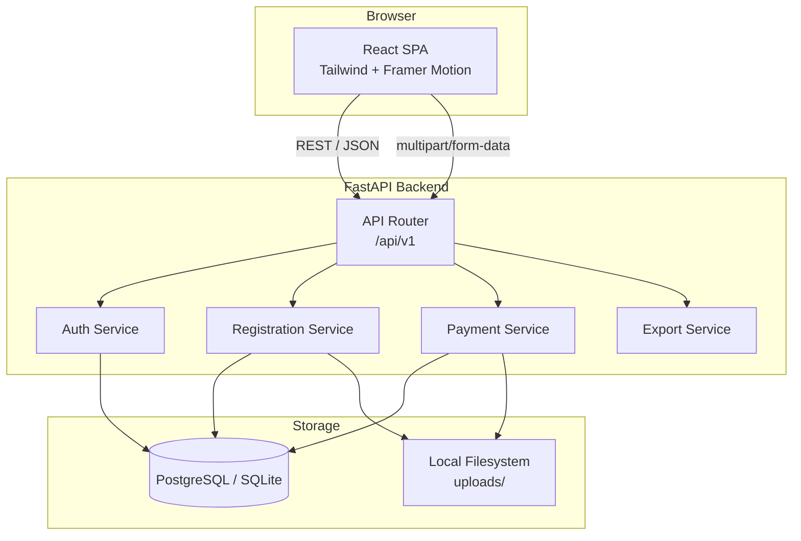
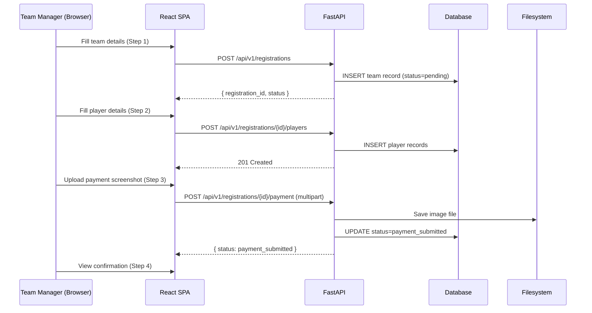
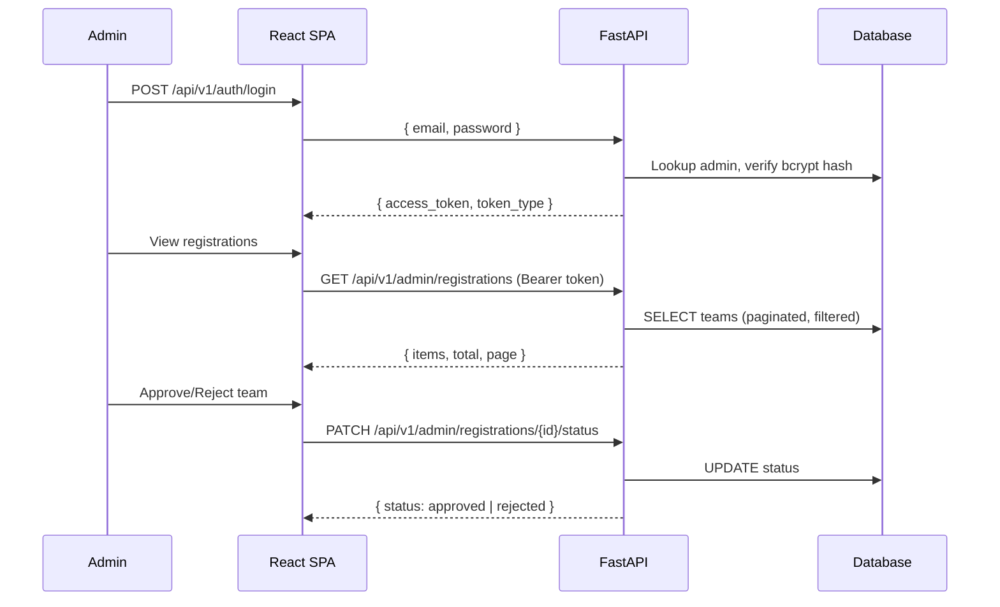
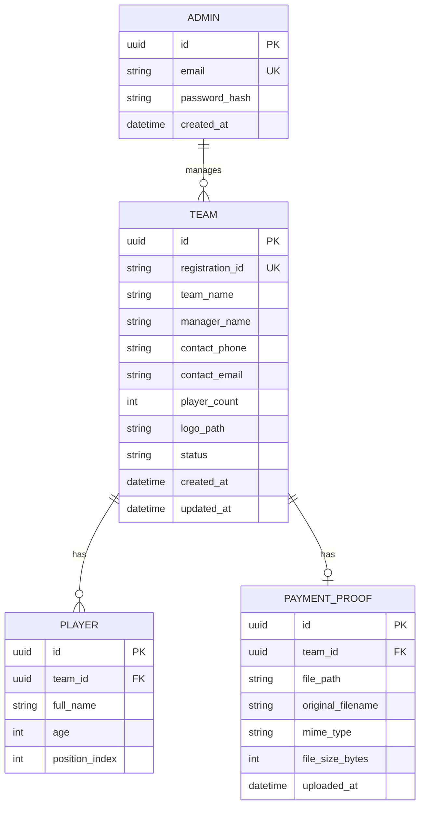

# Design Document

## Football Tournament Registration Website — Shining Star United

---

## Overview

The Shining Star United Football Tournament Registration Website is a full-stack web application that manages the complete lifecycle of tournament team registrations. The system supports two user roles: **Team Manager** (public-facing registration flow) and **Admin** (authenticated dashboard for managing registrations).

The architecture follows a classic client-server separation:

- **Frontend**: A React SPA (Single-Page Application) served statically, communicating with the backend via a REST API.
- **Backend**: A FastAPI application exposing a versioned REST API, handling business logic, authentication, file storage, and database access.
- **Database**: PostgreSQL in production, SQLite in development/testing — accessed through SQLAlchemy's async ORM with a single schema that works on both engines.

The registration flow is a four-step wizard:
1. Team details
2. Player roster
3. UPI payment upload
4. Confirmation

The admin flow is a protected dashboard accessible only via JWT-authenticated sessions.

**Key design decisions:**

- **Stateless JWT auth**: The backend issues short-lived JWTs (≤24 h) for admin sessions. No server-side session store is needed.
- **Local file storage**: Payment proof and team logo images are stored on the server filesystem in a configurable `UPLOAD_DIR`. This keeps the MVP simple and avoids cloud dependencies; the storage layer is abstracted behind a service interface so it can be swapped for S3 or similar later.
- **Dual-database support**: SQLAlchemy's async engine is configured via a `DATABASE_URL` environment variable. `aiosqlite` is used for SQLite (dev/test) and `asyncpg` for PostgreSQL (production).
- **React Hook Form + Zod**: Client-side validation uses Zod schemas per step, keeping validation logic co-located with form definitions and enabling easy server-side schema reuse.

---

## Architecture



### Request Flow — Team Manager Registration



### Request Flow — Admin



---

## Components and Interfaces

### Frontend Components

```
src/
├── pages/
│   ├── HomePage.tsx              # Tournament info + CTA
│   ├── RegisterPage.tsx          # Multi-step wizard host
│   ├── ConfirmationPage.tsx      # Post-submission confirmation
│   ├── AdminLoginPage.tsx        # Admin login form
│   └── AdminDashboardPage.tsx    # Registration management
├── components/
│   ├── registration/
│   │   ├── StepIndicator.tsx     # Progress bar / step dots
│   │   ├── TeamDetailsStep.tsx   # Step 1 form
│   │   ├── PlayerDetailsStep.tsx # Step 2 dynamic player rows
│   │   ├── PaymentStep.tsx       # Step 3 QR + upload
│   │   └── ConfirmationStep.tsx  # Step 4 summary
│   ├── admin/
│   │   ├── RegistrationTable.tsx # Paginated team list
│   │   ├── RegistrationDetail.tsx# Team + players + payment proof
│   │   ├── StatusBadge.tsx       # Color-coded status pill
│   │   └── ExportButton.tsx      # CSV/XLSX download trigger
│   └── shared/
│       ├── ProtectedRoute.tsx    # JWT guard for admin routes
│       ├── FileUpload.tsx        # Drag-and-drop file input
│       └── ErrorBoundary.tsx
├── hooks/
│   ├── useRegistrationWizard.ts  # Step state + navigation
│   └── useAdminAuth.ts           # JWT storage + refresh
├── api/
│   ├── client.ts                 # Axios instance + interceptors
│   ├── registrations.ts          # Registration API calls
│   ├── admin.ts                  # Admin API calls
│   └── auth.ts                   # Auth API calls
└── store/
    └── registrationStore.ts      # Zustand store for wizard state
```

**Multi-step wizard state management**: The wizard uses a Zustand store to persist form data across steps (team details, player list, registration ID). React Hook Form handles per-step validation with Zod schemas. On step submission, data is sent to the API immediately (not batched at the end), so partial progress is saved server-side.

### Backend Modules

```
app/
├── main.py                       # FastAPI app factory, CORS, lifespan
├── config.py                     # Settings via pydantic-settings
├── database.py                   # Async engine + session factory
├── models/                       # SQLAlchemy ORM models
│   ├── team.py
│   ├── player.py
│   └── admin.py
├── schemas/                      # Pydantic request/response schemas
│   ├── team.py
│   ├── player.py
│   ├── auth.py
│   └── common.py
├── routers/
│   ├── registrations.py          # Public registration endpoints
│   ├── auth.py                   # Login endpoint
│   └── admin.py                  # Protected admin endpoints
├── services/
│   ├── registration_service.py   # Team + player CRUD
│   ├── payment_service.py        # File validation + storage
│   ├── auth_service.py           # JWT creation + verification
│   └── export_service.py         # CSV/XLSX generation
├── dependencies/
│   ├── auth.py                   # get_current_admin dependency
│   └── db.py                     # get_db session dependency
└── utils/
    ├── file_storage.py           # Filesystem abstraction
    └── sanitize.py               # Input sanitization helpers
```

### REST API Endpoints

#### Public Endpoints (no auth required)

| Method | Path | Description |
|--------|------|-------------|
| `POST` | `/api/v1/registrations` | Create team registration (Step 1) |
| `POST` | `/api/v1/registrations/{id}/players` | Submit player roster (Step 2) |
| `POST` | `/api/v1/registrations/{id}/payment` | Upload payment proof (Step 3) |
| `GET`  | `/api/v1/registrations/{id}/status` | Get registration status (optional tracking) |

#### Auth Endpoints

| Method | Path | Description |
|--------|------|-------------|
| `POST` | `/api/v1/auth/login` | Admin login, returns JWT |

#### Admin Endpoints (JWT required)

| Method | Path | Description |
|--------|------|-------------|
| `GET`  | `/api/v1/admin/registrations` | List registrations (paginated, filterable) |
| `GET`  | `/api/v1/admin/registrations/{id}` | Get full team detail |
| `PATCH`| `/api/v1/admin/registrations/{id}/status` | Approve or reject |
| `GET`  | `/api/v1/admin/registrations/{id}/payment-proof` | Serve payment proof image |
| `GET`  | `/api/v1/admin/export` | Download CSV/XLSX export |

#### Query Parameters for `GET /api/v1/admin/registrations`

| Parameter | Type | Description |
|-----------|------|-------------|
| `page` | int (default 1) | Page number |
| `page_size` | int (default 20, max 100) | Items per page |
| `status` | enum | Filter by `pending`, `payment_submitted`, `approved`, `rejected` |
| `search` | string | Search by team name or manager name |

---

## Data Models

### Database Schema



### SQLAlchemy ORM Models

**Team**
```python
class Team(Base):
    __tablename__ = "teams"

    id: Mapped[uuid.UUID] = mapped_column(primary_key=True, default=uuid.uuid4)
    registration_id: Mapped[str] = mapped_column(String(20), unique=True, index=True)
    team_name: Mapped[str] = mapped_column(String(100))
    manager_name: Mapped[str] = mapped_column(String(100))
    contact_phone: Mapped[str] = mapped_column(String(15))
    contact_email: Mapped[str] = mapped_column(String(254))
    player_count: Mapped[int] = mapped_column(Integer)
    logo_path: Mapped[Optional[str]] = mapped_column(String(500), nullable=True)
    status: Mapped[str] = mapped_column(
        String(20), default="pending", index=True
    )
    created_at: Mapped[datetime] = mapped_column(default=datetime.utcnow)
    updated_at: Mapped[datetime] = mapped_column(
        default=datetime.utcnow, onupdate=datetime.utcnow
    )

    players: Mapped[List["Player"]] = relationship(back_populates="team", cascade="all, delete-orphan")
    payment_proof: Mapped[Optional["PaymentProof"]] = relationship(back_populates="team", uselist=False)
```

**Player**
```python
class Player(Base):
    __tablename__ = "players"

    id: Mapped[uuid.UUID] = mapped_column(primary_key=True, default=uuid.uuid4)
    team_id: Mapped[uuid.UUID] = mapped_column(ForeignKey("teams.id"), index=True)
    full_name: Mapped[str] = mapped_column(String(100))
    age: Mapped[int] = mapped_column(Integer)
    position_index: Mapped[int] = mapped_column(Integer)  # 0-based order in roster

    team: Mapped["Team"] = relationship(back_populates="players")
```

**PaymentProof**
```python
class PaymentProof(Base):
    __tablename__ = "payment_proofs"

    id: Mapped[uuid.UUID] = mapped_column(primary_key=True, default=uuid.uuid4)
    team_id: Mapped[uuid.UUID] = mapped_column(ForeignKey("teams.id"), unique=True)
    file_path: Mapped[str] = mapped_column(String(500))
    original_filename: Mapped[str] = mapped_column(String(255))
    mime_type: Mapped[str] = mapped_column(String(50))
    file_size_bytes: Mapped[int] = mapped_column(Integer)
    uploaded_at: Mapped[datetime] = mapped_column(default=datetime.utcnow)

    team: Mapped["Team"] = relationship(back_populates="payment_proof")
```

**Admin**
```python
class Admin(Base):
    __tablename__ = "admins"

    id: Mapped[uuid.UUID] = mapped_column(primary_key=True, default=uuid.uuid4)
    email: Mapped[str] = mapped_column(String(254), unique=True, index=True)
    password_hash: Mapped[str] = mapped_column(String(255))
    created_at: Mapped[datetime] = mapped_column(default=datetime.utcnow)
```

### Pydantic Schemas (key examples)

**Registration_ID generation**: A human-readable unique ID is generated at creation time using the pattern `SSU-{YYYYMMDD}-{6-char-random-uppercase}`, e.g. `SSU-20250115-A3KX9Z`. This is stored in `registration_id` and shown to the team manager on the confirmation screen.

**Registration Status enum**:
```python
class RegistrationStatus(str, Enum):
    pending = "pending"
    payment_submitted = "payment_submitted"
    approved = "approved"
    rejected = "rejected"
```

**TeamCreate (request)**:
```python
class TeamCreate(BaseModel):
    team_name: str = Field(..., min_length=1, max_length=100)
    manager_name: str = Field(..., min_length=1, max_length=100)
    contact_phone: str = Field(..., pattern=r"^\d{10}$")
    contact_email: EmailStr
    player_count: int = Field(..., ge=7, le=18)
```

**PlayerCreate (request)**:
```python
class PlayerCreate(BaseModel):
    full_name: str = Field(..., min_length=1, max_length=100)
    age: int = Field(..., ge=5, le=60)
```

**TeamResponse (response)**:
```python
class TeamResponse(BaseModel):
    registration_id: str
    team_name: str
    manager_name: str
    contact_phone: str
    contact_email: str
    player_count: int
    status: RegistrationStatus
    created_at: datetime
    players: List[PlayerResponse] = []
    payment_proof: Optional[PaymentProofResponse] = None

    model_config = ConfigDict(from_attributes=True)
```

### File Storage Layout

```
uploads/
├── logos/
│   └── {team_uuid}_{original_filename}
└── payment_proofs/
    └── {team_uuid}_{original_filename}
```

Files are stored with a UUID prefix to prevent collisions and avoid exposing original filenames in paths. The `file_storage.py` utility abstracts `os.path` operations so the storage backend can be replaced without touching service code.

### Configuration (pydantic-settings)

```python
class Settings(BaseSettings):
    DATABASE_URL: str = "sqlite+aiosqlite:///./dev.db"
    SECRET_KEY: str  # required, no default
    ALGORITHM: str = "HS256"
    ACCESS_TOKEN_EXPIRE_MINUTES: int = 1440  # 24 hours
    UPLOAD_DIR: str = "./uploads"
    MAX_LOGO_SIZE_BYTES: int = 2 * 1024 * 1024       # 2 MB
    MAX_PAYMENT_PROOF_SIZE_BYTES: int = 5 * 1024 * 1024  # 5 MB
    ALLOWED_IMAGE_MIME_TYPES: list[str] = ["image/jpeg", "image/png"]
    CORS_ORIGINS: list[str] = ["http://localhost:5173"]

    model_config = SettingsConfigDict(env_file=".env")
```

---

## Correctness Properties

*A property is a characteristic or behavior that should hold true across all valid executions of a system — essentially, a formal statement about what the system should do. Properties serve as the bridge between human-readable specifications and machine-verifiable correctness guarantees.*

### Property 1: Registration ID uniqueness

*For any* sequence of team registrations, every generated `registration_id` SHALL be distinct — no two teams share the same registration identifier, regardless of how many registrations are created concurrently or sequentially.

**Validates: Requirements 2.3**

---

### Property 2: Player roster integrity

*For any* team registration where `player_count` is N (7 ≤ N ≤ 18), after submitting a valid player roster of N players, the number of Player records associated with that team SHALL equal exactly N, and every submitted player's data SHALL be retrievable under that team's `registration_id`.

**Validates: Requirements 3.1, 3.4**

---

### Property 3: Status transition monotonicity

*For any* team registration, the `status` field SHALL only advance through the allowed forward transitions (`pending` → `payment_submitted` → `approved` or `rejected`). A team in `approved` or `rejected` state SHALL NOT be moved back to `pending` or `payment_submitted` by any API call, and a team in `pending` state SHALL NOT be moved directly to `approved` or `rejected` without first reaching `payment_submitted`.

**Validates: Requirements 2.3, 4.4, 7.3, 7.4**

---

### Property 4: File type and size enforcement

*For any* file upload (team logo or payment proof), the system SHALL accept the file if and only if its MIME type is `image/jpeg` or `image/png` AND its size does not exceed the configured limit (2 MB for logos, 5 MB for payment proofs). Any file that fails either condition SHALL be rejected with a 400 response and SHALL NOT be written to the filesystem.

**Validates: Requirements 2.2, 4.3, 9.5**

---

### Property 5: Server-side validation rejects invalid registration payloads

*For any* POST request to `/api/v1/registrations` where one or more required fields are absent or malformed — including a phone number that is not exactly 10 digits, an email address that does not conform to standard email format, or a `player_count` outside the range [7, 18] — the Registration_Service SHALL return a 400 Bad Request response and SHALL NOT create a Team record in the database.

**Validates: Requirements 2.4, 2.5, 2.6, 3.5, 9.4**

---

### Property 6: Admin endpoint authorization

*For any* request to an admin endpoint (`/api/v1/admin/*`) that does not carry a valid, non-expired JWT signed with the server's secret key in the `Authorization: Bearer` header, the system SHALL return a 401 or 403 response and SHALL NOT return any registration data. This holds for missing tokens, malformed tokens, tokens with invalid signatures, and tokens whose `exp` claim is in the past.

**Validates: Requirements 6.4, 6.5, 6.6, 9.2, 9.3**

---

### Property 7: Export completeness and field coverage

*For any* export request, the generated CSV file SHALL contain exactly one team-level row per registered team and one player-level row per registered player, with no records omitted. Every team row SHALL include: registration identifier, team name, manager name, contact phone, contact email, number of players, Registration_Status, and registration timestamp. Every player row SHALL include: the associated team's registration identifier, player full name, and player age.

**Validates: Requirements 8.1, 8.4, 8.5**

---

### Property 8: Password storage — no plaintext

*For any* password used to create or update an admin account, the value stored in the `password_hash` column SHALL NOT equal the plaintext password, and the hash SHALL be verifiable using the bcrypt algorithm with a salt.

**Validates: Requirements 6.7**

---

### Property 9: Status filter returns only matching teams

*For any* status filter value applied to the admin registration list endpoint, every team returned in the response SHALL have a `status` equal to the requested filter value, and no team with a different status SHALL appear in the results.

**Validates: Requirements 7.6**

---

### Property 10: Search returns only matching teams

*For any* search query string applied to the admin registration list endpoint, every team returned in the response SHALL have a `team_name` or `manager_name` that contains the query string (case-insensitive), and no team whose name and manager name both exclude the query string SHALL appear in the results.

**Validates: Requirements 7.7**

---

### Property 11: Input sanitization preserves data without injection risk

*For any* user-supplied text input (team name, manager name, player name, etc.) containing SQL injection patterns, XSS payloads, or special characters, the system SHALL store a sanitized version of the input in the database and SHALL NOT raise an unhandled exception or alter the database schema.

**Validates: Requirements 9.6**

---

## Error Handling

### HTTP Error Response Format

All API errors return a consistent JSON envelope:

```json
{
  "detail": "Human-readable error message",
  "code": "MACHINE_READABLE_CODE",
  "field_errors": [
    { "field": "contact_phone", "message": "Must be exactly 10 digits" }
  ]
}
```

`field_errors` is only present for validation errors (400).

### Error Scenarios and Handling

| Scenario | HTTP Status | Behavior |
|----------|-------------|----------|
| Missing required field | 400 | Return `field_errors` for each invalid field |
| Invalid phone/email format | 400 | Return field-specific validation message |
| Player count out of range (< 7 or > 18) | 400 | Return validation error before creating players |
| File MIME type not JPEG/PNG | 400 | Reject upload, no file written to disk |
| File exceeds size limit | 413 | Reject upload, no file written to disk |
| Registration ID not found | 404 | Return 404 with descriptive message |
| Payment already submitted | 409 | Return conflict error, do not overwrite existing proof |
| Invalid admin credentials | 401 | Return 401, no JWT issued |
| Expired or missing JWT | 401 | Return 401, redirect hint in response |
| Non-admin accessing admin endpoint | 403 | Return 403 Forbidden |
| Database write failure | 500 | Return 500, log full exception server-side |
| Filesystem write failure | 500 | Return 500, do not update DB status |

### Frontend Error Handling

- **Network errors**: Axios interceptor catches network failures and surfaces a generic retry message.
- **Validation errors (400)**: Field errors are mapped back to React Hook Form's `setError` to display inline messages.
- **File upload failure (Req 4.6)**: The uploaded `File` object is retained in component state so the user can retry without re-selecting.
- **Server errors (500)**: A toast notification prompts the user to retry; the wizard does not advance to the next step.
- **JWT expiry**: The Axios response interceptor detects 401 responses on admin routes and redirects to `/admin/login`.

### Filesystem + Database Atomicity

The payment proof upload follows a write-then-update pattern to avoid orphaned files:

1. Validate file (MIME type, size) — reject early if invalid.
2. Write file to `uploads/payment_proofs/`.
3. Insert `PaymentProof` record in DB.
4. Update `Team.status` to `payment_submitted`.

If step 3 or 4 fails, the file written in step 2 is deleted (cleanup in a `finally` block). This prevents the filesystem from accumulating files that have no corresponding DB record.

---

## Testing Strategy

### Unit Tests

Unit tests cover pure logic and service-layer functions in isolation, using mocked database sessions and a mocked filesystem.

**Key unit test areas:**
- `registration_id` generation: uniqueness across many calls, correct format pattern.
- Pydantic schema validation: valid and invalid inputs for `TeamCreate`, `PlayerCreate`.
- `auth_service`: JWT creation, JWT verification (valid, expired, tampered).
- `payment_service`: MIME type validation, size validation, file path construction.
- `export_service`: CSV row generation for teams and players.
- Frontend Zod schemas: valid/invalid inputs for each wizard step.

### Property-Based Tests

Property-based tests use **Hypothesis** (Python) on the backend and **fast-check** (TypeScript) on the frontend. Each test runs a minimum of 100 iterations.

Tests are tagged with the format: `Feature: football-tournament-registration, Property {N}: {property_text}`

| Property | Test Target | Library | Strategy |
|----------|-------------|---------|----------|
| P1: Registration ID uniqueness | `generate_registration_id()` | Hypothesis | Generate N IDs in sequence, assert all distinct |
| P2: Player roster integrity | `registration_service.create_players()` | Hypothesis | Random N in [7,18], assert len(players)==N and all retrievable |
| P3: Status transition monotonicity | `registration_service.update_status()` | Hypothesis | Random valid/invalid transitions, assert forward-only invariant |
| P4: File type and size enforcement | `payment_service.validate_file()`, `registration_service.validate_logo()` | Hypothesis | Random MIME types and sizes, assert only JPEG/PNG under limit accepted |
| P5: Server-side validation rejects invalid payloads | `TeamCreate` Pydantic schema + API endpoint | Hypothesis | Random malformed payloads (missing fields, bad phone, bad email, out-of-range count), assert 400 and no DB record |
| P6: Admin endpoint authorization | FastAPI `AsyncClient` | Hypothesis | Random tokens (missing, expired, tampered signatures), assert 401/403 |
| P7: Export completeness and field coverage | `export_service.generate_csv()` | Hypothesis | Random team+player sets, assert row counts and all required fields present |
| P8: Password storage — no plaintext | `auth_service.hash_password()` | Hypothesis | Random passwords, assert hash != plaintext and bcrypt.verify passes |
| P9: Status filter returns only matching teams | `admin_service.list_registrations(status=...)` | Hypothesis | Random teams with mixed statuses, assert filter returns only matching |
| P10: Search returns only matching teams | `admin_service.list_registrations(search=...)` | Hypothesis | Random team names and search queries, assert only matching teams returned |
| P11: Input sanitization | `sanitize.sanitize_text()` + DB write | Hypothesis | Random strings with injection patterns, assert no exceptions and safe storage |

### Integration Tests

Integration tests run against a real SQLite database (in-memory) using FastAPI's `TestClient` or `httpx.AsyncClient`.

**Key integration test areas:**
- Full registration wizard: POST team → POST players → POST payment → GET status.
- Admin login → list registrations → approve/reject.
- File upload: valid JPEG accepted, PNG accepted, non-image rejected.
- Export endpoint: returns valid CSV with correct headers and row count.
- Auth guard: unauthenticated requests to admin endpoints return 401/403.

### Frontend Tests

- **Vitest + React Testing Library**: Component tests for each wizard step, form validation feedback, and admin table rendering.
- **fast-check**: Property tests for Zod schema validators (P5 equivalent on the client side).

### Accessibility and Performance

- Lighthouse CI runs on the homepage and registration form pages in CI, asserting a mobile performance score ≥ 70.
- WCAG 2.1 AA color contrast is verified via `axe-core` in component tests.
- Alt text presence on all non-decorative images is asserted in component tests.
