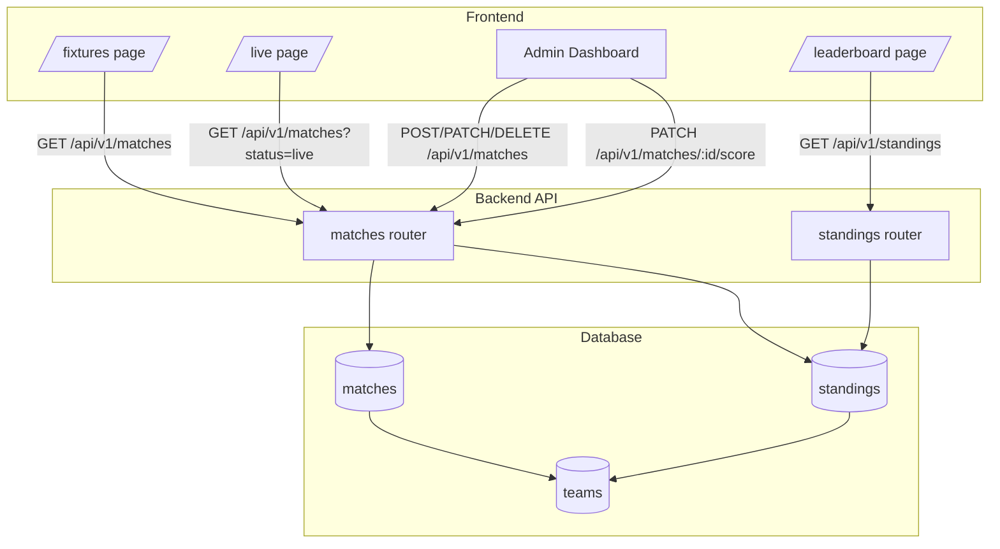
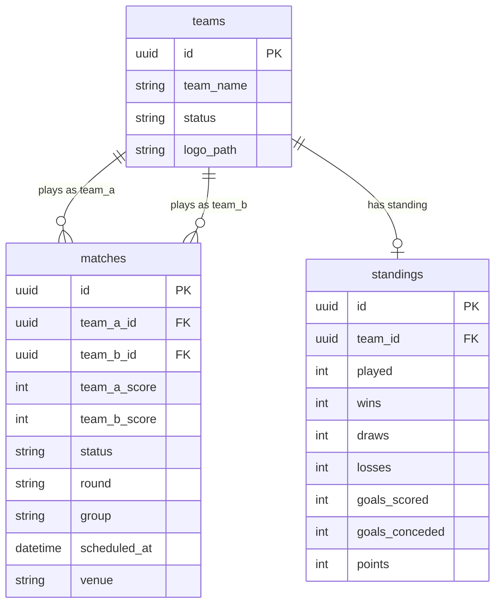

# Design Document: Tournament Management

## Overview

This document describes the technical design for the Tournament Management feature, which extends the Shining Star United Football Tournament Registration System from a registration-only platform into a full tournament management system. The feature adds three interconnected capabilities: a public fixture schedule, live score tracking, and a ranked leaderboard — all managed by admins through an extended dashboard.

The tournament format is a **knockout bracket** (no group stage). Standings are recalculated from scratch whenever a completed match result is revised, ensuring data consistency. Live scores are updated manually by admins; the public pages reflect updates on manual page refresh.

---

## Architecture

The feature follows the existing layered architecture of the project:

```
Frontend (React + TypeScript + Tailwind + Framer Motion)
    │
    ├── Public pages: /fixtures, /leaderboard, /live
    └── Admin dashboard: new tabs (Fixtures, Live Scores)
         │
         ▼
Backend (FastAPI + SQLAlchemy async)
    │
    ├── /api/v1/matches   — fixture CRUD + score updates
    └── /api/v1/standings — leaderboard read
         │
         ▼
PostgreSQL (via asyncpg)
    │
    ├── matches table
    └── standings table (derived from matches)
```



**Key design decisions:**

- **Standings are recalculated from scratch** on every match completion or result revision. This avoids accumulation bugs and makes result editing safe. Given the tournament size (≤32 teams, ≤64 matches), full recalculation is cheap.
- **No WebSocket / push updates.** Live scores are served via standard REST; the public page refreshes on user demand. This matches the stated requirement (manual refresh acceptable) and avoids infrastructure complexity.
- **Standings are stored in a `standings` table** (not computed on every leaderboard request) for query simplicity and to support the existing ORM pattern. They are updated transactionally when a match is completed or revised.

---

## Components and Interfaces

### Backend Components

#### New Router: `backend/app/routers/matches.py`

Registered at `/api/v1/matches`. Handles all fixture and score operations.

| Method | Path | Auth | Description |
|--------|------|------|-------------|
| `GET` | `/matches` | Public | List all fixtures, ordered by `scheduled_at` asc. Supports `?round=` and `?status=` filters. |
| `GET` | `/matches/{match_id}` | Public | Get a single match by UUID. |
| `POST` | `/matches` | Admin | Create a new fixture. |
| `PATCH` | `/matches/{match_id}` | Admin | Update fixture fields (venue, time, round, etc.). |
| `DELETE` | `/matches/{match_id}` | Admin | Delete a fixture. Returns 204. |
| `PATCH` | `/matches/{match_id}/score` | Admin | Update scores and/or status. Triggers standing recalculation when status → `completed`. |

#### New Router: `backend/app/routers/standings.py`

Registered at `/api/v1/standings`. Read-only leaderboard.

| Method | Path | Auth | Description |
|--------|------|------|-------------|
| `GET` | `/standings` | Public | Return all standings sorted by rank (points → GD → GS → name). |

#### New Service: `backend/app/services/standings_service.py`

Contains the standing recalculation logic, isolated from the router for testability.

```python
async def recalculate_standings(db: AsyncSession, team_a_id: UUID, team_b_id: UUID) -> None:
    """
    Recalculate standings for both teams from all their completed matches.
    Called after any match is marked completed or a completed result is revised.
    """
```

The recalculation algorithm:
1. Fetch all `completed` matches involving the team.
2. Sum goals scored, goals conceded, wins, draws, losses, points from scratch.
3. Upsert the `Standing` row for the team.

### Frontend Components

#### New Pages

| Route | File | Description |
|-------|------|-------------|
| `/fixtures` | `frontend/src/pages/FixturesPage.tsx` | Public fixture schedule grouped by round. |
| `/leaderboard` | `frontend/src/pages/LeaderboardPage.tsx` | Public standings table. |
| `/live` | `frontend/src/pages/LivePage.tsx` | Public live scores with manual refresh. |

#### Admin Dashboard Extensions

The existing `AdminDashboardPage.tsx` gains two new tabs:

- **Fixtures tab** — table of all fixtures with create/edit/delete actions.
- **Live Scores tab** — list of all matches with inline score editing and status controls.

New admin components:
- `frontend/src/components/admin/FixturesTab.tsx`
- `frontend/src/components/admin/LiveScoresTab.tsx`
- `frontend/src/components/admin/FixtureForm.tsx` — modal form for create/edit.
- `frontend/src/components/admin/ScoreUpdateForm.tsx` — inline score + status editor.

#### New API Client Functions

Added to `frontend/src/api/` (following existing pattern):

```typescript
// matches.ts
export const getMatches = (params?: { round?: string; status?: string }) => ...
export const getMatch = (id: string) => ...
export const createMatch = (data: MatchCreate) => ...
export const updateMatch = (id: string, data: Partial<MatchCreate>) => ...
export const deleteMatch = (id: string) => ...
export const updateScore = (id: string, data: ScoreUpdate) => ...

// standings.ts
export const getStandings = () => ...
```

---

## Data Models

### `Match` Model (`backend/app/models/match.py`)

```python
class Match(Base):
    __tablename__ = "matches"

    id: Mapped[uuid.UUID] = mapped_column(primary_key=True, default=uuid.uuid4)
    team_a_id: Mapped[uuid.UUID] = mapped_column(ForeignKey("teams.id"), index=True)
    team_b_id: Mapped[uuid.UUID] = mapped_column(ForeignKey("teams.id"), index=True)
    team_a_score: Mapped[Optional[int]] = mapped_column(Integer, nullable=True)
    team_b_score: Mapped[Optional[int]] = mapped_column(Integer, nullable=True)
    status: Mapped[str] = mapped_column(String(20), default="scheduled", index=True)
    # status values: "scheduled" | "live" | "completed"
    round: Mapped[str] = mapped_column(String(50))
    # round values: "Round of 32" | "Round of 16" | "Quarter-Final" | "Semi-Final" | "Final" | "Third Place"
    group: Mapped[Optional[str]] = mapped_column(String(50), nullable=True)
    scheduled_at: Mapped[datetime] = mapped_column(DateTime, index=True)
    venue: Mapped[str] = mapped_column(String(200))
    created_at: Mapped[datetime] = mapped_column(DateTime, default=datetime.utcnow)
    updated_at: Mapped[datetime] = mapped_column(DateTime, default=datetime.utcnow, onupdate=datetime.utcnow)

    team_a: Mapped["Team"] = relationship(foreign_keys=[team_a_id])
    team_b: Mapped["Team"] = relationship(foreign_keys=[team_b_id])
```

**Constraints:**
- `team_a_id != team_b_id` enforced at the application layer (validator in Pydantic schema).
- `team_a_score` and `team_b_score` are nullable (null when status is `scheduled`).
- `status` transitions: `scheduled → live → completed`. Admins can also set `live → scheduled` or `completed → live` (for result revision).

### `Standing` Model (`backend/app/models/standing.py`)

```python
class Standing(Base):
    __tablename__ = "standings"

    id: Mapped[uuid.UUID] = mapped_column(primary_key=True, default=uuid.uuid4)
    team_id: Mapped[uuid.UUID] = mapped_column(ForeignKey("teams.id"), unique=True, index=True)
    played: Mapped[int] = mapped_column(Integer, default=0)
    wins: Mapped[int] = mapped_column(Integer, default=0)
    draws: Mapped[int] = mapped_column(Integer, default=0)
    losses: Mapped[int] = mapped_column(Integer, default=0)
    goals_scored: Mapped[int] = mapped_column(Integer, default=0)
    goals_conceded: Mapped[int] = mapped_column(Integer, default=0)
    points: Mapped[int] = mapped_column(Integer, default=0)

    team: Mapped["Team"] = relationship()

    @property
    def goal_difference(self) -> int:
        return self.goals_scored - self.goals_conceded
```

**Note:** `team_id` has a `unique=True` constraint — one standing row per team. The `goal_difference` is a computed property, not a stored column, to avoid sync issues.

### Pydantic Schemas

**`backend/app/schemas/match.py`**

```python
class MatchCreate(BaseModel):
    team_a_id: uuid.UUID
    team_b_id: uuid.UUID
    scheduled_at: datetime
    venue: str = Field(..., min_length=1, max_length=200)
    round: str = Field(..., min_length=1, max_length=50)
    group: Optional[str] = Field(None, max_length=50)

    @model_validator(mode="after")
    def teams_must_differ(self) -> "MatchCreate":
        if self.team_a_id == self.team_b_id:
            raise ValueError("Team A and Team B must be different teams")
        return self

class MatchUpdate(BaseModel):
    scheduled_at: Optional[datetime] = None
    venue: Optional[str] = Field(None, min_length=1, max_length=200)
    round: Optional[str] = Field(None, min_length=1, max_length=50)
    group: Optional[str] = None

class ScoreUpdate(BaseModel):
    team_a_score: Optional[int] = Field(None, ge=0)
    team_b_score: Optional[int] = Field(None, ge=0)
    status: Optional[MatchStatus] = None  # "scheduled" | "live" | "completed"

class MatchResponse(BaseModel):
    id: uuid.UUID
    team_a_id: uuid.UUID
    team_b_id: uuid.UUID
    team_a_name: str       # denormalized from Team join
    team_b_name: str       # denormalized from Team join
    team_a_score: Optional[int]
    team_b_score: Optional[int]
    status: str
    round: str
    group: Optional[str]
    scheduled_at: datetime
    venue: str
    model_config = ConfigDict(from_attributes=True)
```

**`backend/app/schemas/standing.py`**

```python
class StandingResponse(BaseModel):
    team_id: uuid.UUID
    team_name: str
    team_logo: Optional[str]
    played: int
    wins: int
    draws: int
    losses: int
    goals_scored: int
    goals_conceded: int
    goal_difference: int   # computed: goals_scored - goals_conceded
    points: int
    model_config = ConfigDict(from_attributes=True)
```

### Database Relationships



---

## Correctness Properties

*A property is a characteristic or behavior that should hold true across all valid executions of a system — essentially, a formal statement about what the system should do. Properties serve as the bridge between human-readable specifications and machine-verifiable correctness guarantees.*

### Property 1: Fixture creation round-trip

*For any* valid fixture payload (two distinct team IDs, a future datetime, a non-empty venue, and a valid round), creating a fixture and then fetching it by the returned ID should return a fixture whose fields exactly match the creation payload.

**Validates: Requirements 1.1**

---

### Property 2: Same-team fixture rejection

*For any* team ID, submitting a fixture creation request with that ID as both `team_a_id` and `team_b_id` should always be rejected with a 422 validation error.

**Validates: Requirements 1.2**

---

### Property 3: Fixture update reflects changes

*For any* existing fixture and any valid partial update payload (venue, scheduled_at, round, or group), the PATCH response should contain the updated values, and a subsequent GET by ID should return the same updated values.

**Validates: Requirements 1.4**

---

### Property 4: Fixture deletion removes from database

*For any* created fixture, deleting it should return 204, and a subsequent GET by the same ID should return 404.

**Validates: Requirements 1.6**

---

### Property 5: Fixture list is ordered by scheduled date ascending

*For any* set of fixtures with distinct `scheduled_at` values, the list endpoint should return them in strictly ascending order of `scheduled_at`.

**Validates: Requirements 1.7, 2.1**

---

### Property 6: Fixture list filtering by round returns only matching fixtures

*For any* round value and any set of fixtures with varying rounds, filtering the list by that round should return only fixtures whose `round` field equals the filter value — no fixtures from other rounds should appear.

**Validates: Requirements 1.8**

---

### Property 7: Fixture response contains all required fields

*For any* created fixture, the public list endpoint response for that fixture should include non-null values for: `id`, `team_a_name`, `team_b_name`, `scheduled_at`, `venue`, `round`, and `status`.

**Validates: Requirements 2.2**

---

### Property 8: Score update persists scores and sets status to live

*For any* pair of non-negative integers `(a, b)`, submitting a score update for an existing scheduled or live match should persist `team_a_score = a` and `team_b_score = b`, and the match status should be `"live"` after the update.

**Validates: Requirements 3.1**

---

### Property 9: Negative score values are always rejected

*For any* negative integer `n`, submitting it as either `team_a_score` or `team_b_score` in a score update request should always return a 422 validation error.

**Validates: Requirements 3.2**

---

### Property 10: Match completion correctly updates standings (points, W/D/L, goals)

*For any* match with scores `(a, b)` where both are non-negative integers, marking the match as completed should result in standings where:
- If `a > b`: team A gains 3 points, 1 win, 0 draws, 0 losses; team B gains 0 points, 0 wins, 0 draws, 1 loss.
- If `a == b`: both teams gain 1 point, 0 wins, 1 draw, 0 losses.
- If `a < b`: team A gains 0 points, 0 wins, 0 draws, 1 loss; team B gains 3 points, 1 win, 0 draws, 0 losses.
- Team A's `goals_scored` increases by `a` and `goals_conceded` increases by `b`.
- Team B's `goals_scored` increases by `b` and `goals_conceded` increases by `a`.

**Validates: Requirements 3.4, 3.5, 3.6, 3.7, 5.8**

---

### Property 11: Completed match score update is rejected

*For any* match with status `"completed"`, any attempt to update its scores via the score update endpoint should return a 409 or 400 error with a descriptive message.

**Validates: Requirements 3.8**

---

### Property 12: Match fetch by ID returns all required fields

*For any* created match, fetching it by ID from the public endpoint should return a response containing non-null values for: `id`, `team_a_name`, `team_b_name`, `status`, `scheduled_at`, `venue`, and `round`. Score fields should be present (possibly null for scheduled matches).

**Validates: Requirements 4.4**

---

### Property 13: Leaderboard ordering respects all tiebreakers

*For any* set of team standings, the leaderboard endpoint should return them sorted such that:
1. Teams with more points appear before teams with fewer points.
2. Among teams with equal points, teams with higher goal difference appear first.
3. Among teams with equal points and equal goal difference, teams with more goals scored appear first.
4. Among teams with equal points, equal goal difference, and equal goals scored, teams appear in ascending alphabetical order by team name.

**Validates: Requirements 5.2, 5.3, 5.4, 5.5**

---

### Property 14: Leaderboard response contains all required fields

*For any* team with at least one completed match, its leaderboard entry should include non-null values for: `team_name`, `played`, `wins`, `draws`, `losses`, `goals_scored`, `goals_conceded`, `goal_difference`, and `points`. The `team_logo` field may be null if no logo was uploaded.

**Validates: Requirements 5.6**

---

### Property 15: Standing recalculation on result revision

*For any* completed match whose result is revised (scores changed and re-completed), the standings for both participating teams should reflect only the revised result — not the original result plus the revised result. The recalculation should be idempotent: revising to the same scores twice should produce the same standings as revising once.

**Validates: Requirements 5.9**

---

## Error Handling

### Backend Error Responses

All errors follow the existing FastAPI pattern with JSON bodies.

| Scenario | HTTP Status | Detail |
|----------|-------------|--------|
| Fixture not found | 404 | `"Match not found"` |
| Standing not found | 404 | `"Standing not found"` |
| Same team in fixture | 422 | `"Team A and Team B must be different teams"` |
| Missing required field | 422 | Pydantic field error with location |
| Negative score | 422 | `"team_a_score: Input should be greater than or equal to 0"` |
| Score update on completed match | 409 | `"Cannot update score: match is already completed"` |
| Invalid status value | 422 | Pydantic enum validation error |
| Team not found (fixture creation) | 404 | `"Team not found: {team_id}"` |

### Frontend Error Handling

- API errors are caught and displayed as toast notifications (following existing pattern).
- Form validation errors are shown inline below the relevant field.
- The live scores page shows a friendly empty state when no live matches exist.
- Network errors on public pages show a retry button.

### Standing Recalculation Safety

The `recalculate_standings` service function runs inside the same database transaction as the match status update. If the recalculation fails, the entire transaction rolls back — preventing a state where a match is marked completed but standings are not updated.

---

## Testing Strategy

### Unit Tests

Located in `backend/tests/`. Follow the existing `test_integration.py` pattern using `pytest` with an async test client.

**Focus areas:**
- `standings_service.recalculate_standings` — pure logic, test with various score combinations.
- Pydantic schema validators — `MatchCreate.teams_must_differ`, `ScoreUpdate` non-negative constraint.
- Leaderboard sorting logic — test all tiebreaker combinations.

### Property-Based Tests

Use **[Hypothesis](https://hypothesis.readthedocs.io/)** for Python property-based testing. Minimum 100 iterations per property.

Each property test is tagged with a comment referencing the design property:
```python
# Feature: tournament-management, Property N: <property_text>
```

**Properties to implement as Hypothesis tests:**

| Property | Strategy |
|----------|----------|
| P1: Fixture creation round-trip | `st.uuids()`, `st.datetimes()`, `st.text()` for venue/round |
| P2: Same-team rejection | `st.uuids()` for a single team ID used for both slots |
| P3: Fixture update reflects changes | `st.text()` for venue, `st.datetimes()` for scheduled_at |
| P5: Fixture list ordering | `st.lists(st.datetimes(), min_size=2, unique=True)` |
| P6: Round filtering | `st.sampled_from(VALID_ROUNDS)` |
| P8: Score update persists | `st.integers(min_value=0, max_value=20)` for scores |
| P9: Negative score rejection | `st.integers(max_value=-1)` |
| P10: Match completion standings | `st.integers(min_value=0, max_value=20)` for both scores |
| P11: Completed match rejection | Fixed: create match, complete it, attempt score update |
| P13: Leaderboard ordering | `st.lists(st.builds(StandingFactory), min_size=2)` |
| P15: Standing recalculation idempotence | Two revisions to same scores → same standings |

### Frontend Tests

Use **Vitest** + **React Testing Library** (consistent with the Vite-based project).

- Unit tests for leaderboard sorting utility function.
- Example tests for fixture grouping by round.
- Example tests for live/completed match visual indicators.
- Example tests for empty state on live scores page.

### Integration Tests

Extend `backend/tests/test_integration.py` with end-to-end scenarios:

1. Full match lifecycle: create fixture → update score (live) → mark completed → verify standings.
2. Result revision: complete match → revise result → verify standings recalculated correctly.
3. Leaderboard ordering: create multiple teams with known standings → verify leaderboard order.
4. Public endpoint access: verify `/matches` and `/standings` return 200 without auth headers.
